```{r setup, include=FALSE}
knitr::opts_chunk$set(echo = TRUE,comment = NA)
```

# Introduction

The project is based on devising an approach to model carbon emission based on longitudinal data for different countries (100 in number). Due to limitation in the available data, the approach is thought to carefully look into statistical properties while preparing the models. Here the data (secondary data) available is taken from different sources and consolidated into a single structured data that can be used for modeling. 

Note - Also making small changes to the code for better presentation in the blog. But the approach to the problem is similar to the report provided.

# Dealing with data

The data for different countries have been drawn from different sources. Please refer to Section 6.2 in the [report](https://1drv.ms/b/s!ApFYtM4ZFefbgxpGtypiPWaMjT_1) for knowing the sources and the description of the fields taken.

## Importing and description

The structured data is created by combining data from different sources into one single dataset. The dataset consists of 100 countries as subjects with initially 14 variables across 10 years time period (2007-2016). 

```{r carbon,warning=FALSE,message=FALSE}
#importing file
carbon <- read.csv('final_data_climate_change.csv', header = T)
carbon.copy <- carbon

#variable names of the dataframe
names(carbon)

attach(carbon)

```

## Descriptive Statistics

As initial steps, we need to have a careful look at the various information about all the variables. The descriptive information can be interpreted based on subject knowledge and how different fields are going to affect the model.

```{r summary,warning=FALSE,message=FALSE}
library(psych)

options(scipen = 99999)

describe(carbon[, 4:13], fast = TRUE)

#checking the categorical variables
table(ind_hdi)
table(ind_inflation)
table(ind_elec)
table(ind_elec,year)

```

## Correlation matrix

Looking at the distribution of dependent variable and correlation matrix between different variables

```{r Analyzing and visual}
# finding correlation between numerical variables
library(psych)
pairs.panels(
  carbon[, 4:13],
  method = "pearson",
  hist.col = "#00AFBB",
  density = TRUE,
  ellipses = F,
  main = "Correlation and scatter plot of the data"
)

```

# Variable Selection

## Based on descriptive

1. ind_elec: One level of this variable is having high frequency and hence it can be considered insignificant.
2. fuel_export and fuel_import : Since the values of these are already included in the gdp variable this can result in double counting hence it can be dropped
3. land_area: Since this area includes agri_area and forest_area so there will be double counting and hence we can drop this variable

## Based on correlation matrix

4. temp_change: Since this variable is having almost no correlation with response variable and also based on geographical understanding temp_change does not influence co2 emission but its the other way round.

```{r variable selection}

#dropping the above variables
carbon <- carbon[, c(-7, -8, -12, -13, -16)]

#Standardizing the numerical variables to remove the unit problem and high value variables
carbon[, 4:9] <- scale(carbon[, 4:9], center = T, scale = T) + 3
```

Note: We are trying to make a basic model after dropping the above variables and again conducting the stepwise regression for statistical significance

```{r,results='hide'}
#creating basic glm model
obj <-
  glm(
    formula = co2emission ~ .,
    data = carbon[, 3:11],
    family = Gamma(link = inverse)
  )
summary(obj)
hist(obj$residuals, xlab = "Residuals",
     main = "Distribution of Residuals")

```

## Based on stepwise regression

```{r}
#Going for stepwise regression and checking if significance of variables
step(obj, direction = "both")
```

5. gnipercapita: By looking at the stepwise regression we can say that this variable is insignificant and hence can be dropped.

```{r}
#From stepwise we see that gnipercapita can also be dropped
#Finally we get the variables for modeling as
carbon <- carbon[, -6]
var_name <- names(carbon)
```

```{r,echo=FALSE}
#Final dataset
carbon <- carbon.copy[, var_name]
carbon.copy <- carbon.copy[, var_name]
```

# Creating functions

## Day Forward Technique

```{r,eval=FALSE}
#Performance Evaluation of training set using day forward technique
#GLM Model
day_forward.glm <- function(x) {
  ...Refer to report (Chapter 7)
}

# Robust Regression
day_forward.glmrob <- function (x) {
  ...Refer to report (Chapter 7)
}
```

## Predict Second Half Technique

```{r,eval=FALSE}
#Performance Evaluation of training set using Predict second half technique
#GLM Model
predict_second_half.glm <- function(x) {
  ...Refer to report (Chapter 7)
}

# Robust Regression
predict_second_half.glmrob <- function (x) {
  ...Refer to report (Chapter 7)
}
```

## Model Building

```{r,eval=FALSE}
#Function for model building
#GLM Model
model.glm <- function (x) {
  ...Refer to report (Chapter 7)
}

#Robust GLM Model
model.glmrob <- function (x) {
  ...Refer to report (Chapter 7)
}
```

## Model Graph Display

```{r,eval=FALSE}
#Function for graphical display
#GLM Model
draw.glm <- function(object,st) {
  # Model Adequacy Checking
  # Residual Plots
  # QQ plots
  ...Refer to report (Chapter 7)
}    

#Robust GLM Model
draw.glmrob <- function (object,st) {
  # Model Adequacy Checking
  # Residual Plots
  # QQ plots
  ...Refer to report (Chapter 7)
}
```

## Prediction Error

```{r,eval=FALSE}
        
 #Prediction error function
 #GLM Model
 predicterror.glm <- function(object,z) {
   ...Refer to report (Chapter 7)
 }
 
 #Robust GLM Model
 predicterror.glmrob <- function(object,z) {
   ...Refer to report (Chapter 7)
}
            
```

```{r, echo=FALSE}
#Creating some functions
#Performance Evaluation of training set using day forward technique
day_forward.glm<-function(x)
{
  avgmse=vector()
  c=0
  for(i in 2:max(x$year))
  {
    train=x[x$year>=1 & x$year<i,]
    test=x[x$year==i,]
    regressor=glm(formula=co2emission~.,data=train[,3:ncol(train)],
                  family = Gamma(link=inverse))
    yhat=predict(regressor,test[,3:ncol(test)],type='response')
    yobs=test$co2emission
    avgmse=c(avgmse,mean((yhat-yobs)^2))
    c=c+1
  }
  print(avgmse)
  return(sum(avgmse)/c)
}

#Performance Evaluation of training set using Predict second half technique
predict_second_half.glm<-function(x)
{
  avgmse=vector()
  c=0
  for(i in 1:(max(x$year)/2))
  {
    da=x[x$year>=1 & x$year<=2*i,]
    train=da[da$year<=(max(da$year)/2),]
    test=da[da$year>(max(da$year)/2),]
    regressor=glm(formula=co2emission~.,data=train[,3:ncol(train)],
                  family = Gamma(link=inverse))
    yhat=predict(regressor,test[,3:ncol(test)],type='response')
    yobs=test$co2emission
    avgmse=c(avgmse,mean((yhat-yobs)^2))
    c=c+1
  }
  print(avgmse)
  return(sum(avgmse)/c)
}

#Function for model building
model.glm<-function(x)
{
  x<-training_set[,3:10]
  regressor <-
    glm(
      formula = co2emission ~ .,
      data = training_set[,3:10],
      family = Gamma(link = inverse)
    )
  library(rsq)
  cat("The R squared value is ", rsq(regressor))
  return(regressor)
} 

draw.glm <- function(object, st)
{
  #Model adequacy checking
  #Residual plots
  d = fortify(object)
  g = ggplot(d,aes(x=.resid))+
    geom_histogram(aes(y=..density..),color="black",fill="black",alpha=0.6)+
    geom_density(alpha=0.3,color='black',lwd=0.75,fill='grey')+
    ylab("Density")+
    xlab("Residuals")+
    ggtitle(paste0("Histogram of residual-",st))+
    theme(
      panel.grid.major = element_blank(), 
      panel.grid.minor = element_blank(),
      panel.background = element_rect(fill = "transparent",colour = NA),
      plot.background = element_rect(fill = "transparent",colour = NA),
      plot.title = element_text(hjust = 0.5)
    )
  print(g)
  #QQ plot
  plot(object, which=2,col=c('red'), main = st)
}


#Prediction error function #GLM Model
predicterror.glm <- function(object ,z) {
  #Prediction
  pred=predict(object,z,type='response')
  obs=z$co2emission
  mean.squared.error=mean((obs-pred)^2)
  return(mean.squared.error)
}


#Performance Evaluation of training set using day forward technique
day_forward.glmrob<-function(x)
{
  library(robustbase)
  avgmse=vector()
  c=0
  for(i in 2:max(x$year))
  {
    train=x[x$year>=1 & x$year<i,]
    test=x[x$year==i,]
    regressor=glmrob(formula=co2emission~.,data=train[,3:ncol(train)],model=T,
                     family = Gamma(link=inverse))
    yhat=predict(regressor,test[,3:ncol(test)],type='response')
    yobs=test$co2emission
    avgmse=c(avgmse,mean((yhat-yobs)^2))
    c=c+1
  }
  print(avgmse)
  return(sum(avgmse,na.rm=T)/(c-sum(is.na(avgmse))))
}


#Predict second half Robust GLM validation
predict_second_half.glmrob<-function(x)
{
  library(robustbase)
  avgmse=vector()
  c=0
  for(i in 1:(max(x$year)/2))
  {
    da=x[x$year>=1 & x$year<=2*i,]
    train=da[da$year<=(max(da$year)/2),]
    test=da[da$year>(max(da$year)/2),]
    regressor=glmrob(formula=co2emission~.,data=train[,3:ncol(train)],model=T,
                     family = Gamma(link=inverse))
    yhat=predict(regressor,test[,3:ncol(test)],type='response')
    yobs=test$co2emission
    avgmse=c(avgmse,mean((yhat-yobs)^2))
    c=c+1
  }
  print(avgmse)
  return(sum(avgmse,na.rm=T)/(c-sum(is.na(avgmse))))
}

model.glmrob <- function(x)
{
  x<-x[,3:10]
  #robust regression of glm model
  library(robustbase)
  regressor <-
    glmrob(
      formula = co2emission ~ .,
      data = x,
      model = T,
      family = Gamma(link = inverse)
    )
  actual <- x$co2emission
  preds <- regressor$fitted.values
  rss <- sum((preds - actual) ^ 2)
  tss <- sum((actual - mean(actual)) ^ 2)
  rsq <- 1 - rss / tss
  cat("The R squared value for the model is ", rsq)
  return(regressor)
}

draw.glmrob <- function(object, st){
  d = data.frame(object$residuals, object$fitted.values)
  names(d) = c('residuals', 'fitted values')
  g = ggplot(d, aes(x = residuals)) +
    geom_histogram(aes(y = ..density..),
                   color = "black",
                   fill = "black",
                   alpha = 0.6) +
    geom_density(
      alpha = 0.3,
      color = 'black',
      lwd = 0.75,
      fill = 'grey'
    ) +
    ylab("Density") +
    xlab("Residuals") +
    ggtitle(paste0("Histogram of residual-",st)) +
    theme(
      panel.grid.major = element_blank(),
      panel.grid.minor = element_blank(),
      panel.background = element_rect(fill = "transparent", colour = NA),
      plot.background = element_rect(fill = "transparent", colour = NA),
      plot.title = element_text(hjust = 0.5)
    )
  print(g)
  #QQ plot
  qqnorm(
    object$residuals,
    pch = 1,
    col = 'red',
    main = paste0(st, "\nNormal Q-Q Plot")
  )
  qqline(object$residuals, lty = 2, lwd = 1)
}

#Robust GLM Model
predicterror.glmrob<-function(object ,z) {
  #Model Comparison
  pred=predict(object,z,type='response')
  obs=z$co2emission
  mean.squared.error=mean((obs-pred)^2)
  return(mean.squared.error)
}

```

# Feature Scaling

```{r}
### Feature scaling
carbon[, 4:8] <- scale(carbon[, 4:8]) + 3
```

# Train and Test set

Taking the first 8 years as training set and last 2 years as test set for validation of model on the overall dataset.

```{r}
##Splitting the data into train and test
training_set = carbon[carbon$year >= 1 & carbon$year <= 8, ]
test_set = carbon[carbon$year == 9 | carbon$year == 10, ]
```

# Clustering

We already know that for every country the carbon emission will not be same. For big or developed and developing countries it will be high and for smaller countries it will be low. So a single model will not be efficient in tackling this problem. This can be solved by grouping countries based on different features and then building models based on the grouping to which it belongs.

## Data Manipulation

```{r,eval=FALSE,warning=FALSE}
carbon<-carbon.copy

#Converting categorical to ordinal data
library(plyr)
carbon$ind_hdi <-
  mapvalues(
    carbon$ind_hdi,
    from = c("low", "medium", "high", "Very high"),
    to = c(1, 2, 3, 4)
  )
carbon$ind_inflation <- mapvalues(
  carbon$ind_inflation,
  from = c(
    "deflation",
    "creeping/low",
    "walking/moderate",
    "running",
    "galloping"
  ),
  to = c(1, 2, 3, 4, 5)
)

carbon$ind_hdi = as.factor(carbon$ind_hdi)
carbon$ind_inflation = as.factor(carbon$ind_inflation)

#Bringing the variables to same level through transformation
carbon[, 4:8] <- log(carbon[, 4:8])

#Normalizing the variables both continuous and ordinal
library(BBmisc)
carbon[, 4:10] <- normalize(carbon[, 4:10], method = "range", range = c(0, 1))
```

## Distance Matrix

```{r,eval=FALSE}
dd <- matrix(0, nrow = 100, ncol = 100)
cc <- matrix(0, nrow = 100, ncol = 100)
for (i in 1:10)
{
  carb_clus <- carbon[carbon$year == i, c(-1, -3)]
  cc <- as.matrix(dist(carb_clus[, -1], method = 'euclidean'))
  cc <- cc ^ 2
  dd = dd + cc
}
dd = sqrt(dd)
```

## Cluster number choice

```{r,eval=FALSE}
#Elbow method
library(cluster)
sil_width <- c(NA)
for (i in 2:10)
{
  pam_fit <- pam(dd, diss = TRUE, k = i)
  sil_width[i] <- pam_fit$silinfo$avg.width
}

# Plot sihouette width (higher is better)
plot(1:10, sil_width,
     xlab = "Number of clusters",
     ylab = "Silhouette Width")
lines(1:10, sil_width)
```

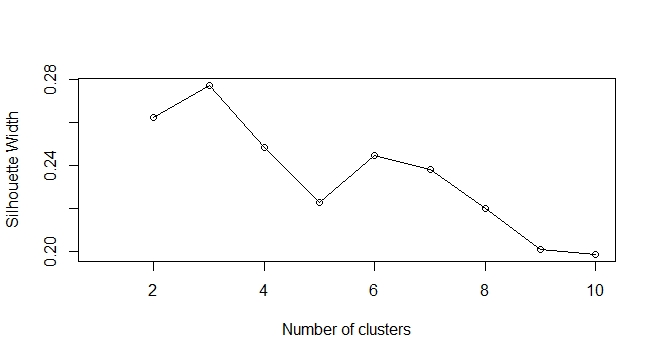

## PAM Algorithm

```{r,eval=FALSE}
#By looking at plot, optimal no of cluster is 3
pam_fit <- pam(dd, diss = TRUE, k = 3)
pam_cluster = pam_fit$clustering
pam_cluster

#Preparing cluster list
cluster_list <- data.frame(carbon[carbon$year == 1, 2], pam_cluster)
names(cluster_list) <- c("countries", "cluster_no")
```

## Plotting clusters

```{r,eval=FALSE}
#Plotting cluster numbers in a graph
library(Rtsne)
tsne_obj <- Rtsne(dd, is_distance = TRUE)
library(magrittr) # needs to be run every time you start R and want to use %>%
library(dplyr)
tsne_data <- tsne_obj$Y %>%
  data.frame() %>%
  setNames(c("X", "Y")) %>%
  mutate(cluster = factor(pam_cluster),
         name = cluster_list$countries)

library(ggplot2)
ggplot(aes(x = X, y = Y), data = tsne_data) +
  geom_point(aes(color = cluster), size = 3)

library(dplyr)
carbon_clus.submodel <-
  left_join(carbon.copy, cluster_list, by = "countries")
carbon_clus.classify <- left_join(carbon, cluster_list, by = "countries")
```

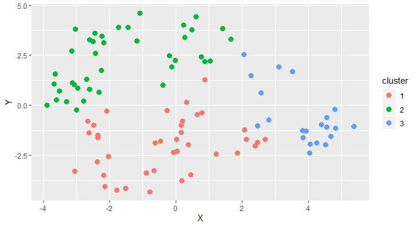

## Map Visualization

```{r,warning=FALSE,eval=FALSE}
library(googleVis)
WorldMap = cluster_list
G5 <- gvisGeoChart(
  WorldMap,
  "countries",
  "cluster_no",
  options = list(
    displayMode = 'auto',
    dataMode = "regions",
    colorAxis = "{colors:['blue', 'red','green']}",
    backgroundColor = "lightblue",
    width = 800,
    height = 400,
    legend = "{colors:['blue','red','green']}"
  )
)

plot(G5)
#Only countries not plotted-Malta,Bahrain,Barbados,St. Lucia due to small area size
```

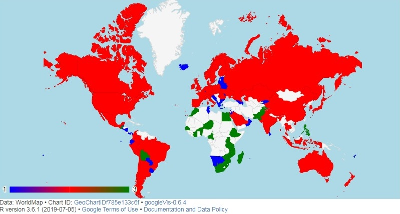

## Descriptive Statistics of clustered countries

```{r,eval=FALSE,echo=FALSE}
clustered_data <- carbon_clus.submodel
clustered_data[, 4:8] <- scale(clustered_data[, 4:8]) + 3
submodel1 <- clustered_data[clustered_data$cluster_no == 1,-11]
submodel2 <- clustered_data[clustered_data$cluster_no == 2,-11]
submodel3 <- clustered_data[clustered_data$cluster_no == 3,-11]

#Getting summary statistics table for clusters
t = data.frame()
for (i in 2:10)
{
  if (i == 2)
  {
    t[i, 1] = length(unique(submodel1[, i]))
    t[i, 2] = length(unique(submodel2[, i]))
    t[i, 3] = length(unique(submodel3[, i]))
  }
  if (i >= 3 & i <= 8)
  {
    t[i, 1] = paste0("(", round(min(submodel1[, i]), 4), ",",
                     round(max(submodel1[, i]), 4), ")")
    t[i, 2] = paste0("(", round(min(submodel2[, i]), 4),
                     ",", round(max(submodel2[, i]), 4), ")")
    t[i, 3] = paste0("(", round(min(submodel3[, i]), 4), ",",
                     round(max(submodel3[, i]), 4), ")")
  }
  if (i == 9)
  {
    z = cbind(paste(rownames(table(submodel1[, 9])), table(submodel1[, 9])),
              paste(rownames(table(submodel2[, 9])), table(submodel2[, 9])),
              paste(rownames(table(submodel3[, 9])), table(submodel3[, 9])))
    t = rbind(t, z)
  }
  if (i == 10)
  {
    z = cbind(paste(rownames(table(submodel1[, 10])), table(submodel1[, 10])),
              paste(rownames(table(submodel2[, 10])), table(submodel2[, 10])),
              paste(rownames(table(submodel3[, 10])), table(submodel3[, 10])))
    t = rbind(t, z)
  }
}
t = t[-1,]
rownames(t) <-
  c(
    "No of countries",
    "year",
    "pop_total",
    "co2emission",
    "gdp",
    "forest_area",
    "agri_area",
    "ind_hdi1",
    "ind_hdi2",
    "ind_hdi3",
    "ind_hdi4",
    "ind_inflation1",
    "ind_inflation2",
    "ind_inflation3",
    "ind_inflation4",
    "ind_inflation5"
  )
colnames(t) <- c("cluster1", "cluster2", "cluster3")
```

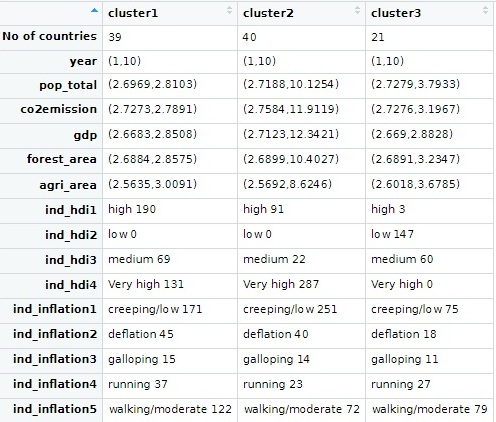

## Merging levels of certain fields

In 1st cluster
- ind_hdi ==> low level + medium level
- ind_inflation ==> galloping + running

In 2nd Cluster
- ind_hdi ==> low + medium

In 3rd cluster
- ind_hdi ==> Very high + high + medium
- ind_inflation ==> galloping + running

```{r,eval=FALSE,echo=FALSE}
############ Merging some levels in the clustered data ####################
mergelevel <- function(submodel, choice) {
  #In 1st cluster
  #ind_hdi==>low level+medium level
  #ind_inflation==>galloping+running
  
  library(plyr)
  
  if (choice == '1')
  {
    submodel$ind_hdi <- mapvalues(
      submodel$ind_hdi,
      from = c("low", "medium", "high", "Very high"),
      to = c('low+medium', 'low+medium', 'high', 'Very high')
    )
    submodel$ind_inflation <- mapvalues(
      submodel$ind_inflation,
      from = c(
        "deflation",
        "creeping/low",
        "walking/moderate",
        "running",
        "galloping"
      ),
      to = c(
        "deflation+low",
        "deflation+low",
        "walking/moderate",
        'running+galloping',
        'running+galloping'
      )
    )
  }
  
  if (choice == '2')
  {
    #In 2nd Cluster
    #ind_hdi==>low+medium
    submodel$ind_hdi <- mapvalues(
      submodel$ind_hdi,
      from = c("low", "medium", "high", "Very high"),
      to = c('low+medium', 'low+medium', 'high', 'Very high')
    )
  }
  
  if (choice == '3')
  {
    #In 3rd cluster
    #ind_hdi==>Very high+high+medium
    #ind_inflation==>galloping+running
    submodel$ind_hdi <- mapvalues(
      submodel$ind_hdi,
      from = c("low", "medium", "high", "Very high"),
      to = c(
        'low',
        'medium+high+veryhigh',
        'medium+high+veryhigh',
        'medium+high+veryhigh'
      )
    )
    
    submodel$ind_inflation <- mapvalues(
      submodel$ind_inflation,
      from = c(
        "deflation",
        "creeping/low",
        "walking/moderate",
        "running",
        "galloping"
      ),
      to = c(
        "deflation+low",
        "deflation+low",
        "walking/moderate",
        'running+galloping',
        'running+galloping'
      )
    )
  }
  
  return(submodel)
}
```

# Data Modeling

## Distibution of dependent variable

```{r,eval=FALSE}
# taking the variable co2emission
summary(co2emission)
library (ggplot2)
library(ggplot2)
ggplot(carbon, aes(x = co2emission)) +
  geom_histogram(aes(y = ..count..),
                 color = "black",
                 fill = "grey",
                 bins = 15) +
  ylab("Frequency of the variable") +
  xlab("Carbon Dioxide Emission") +
  ggtitle("Histogram of carbon dioxide emission of complete data") +
  theme(
    panel.grid.major = element_blank(),
    panel.grid.minor = element_blank(),
    panel.background = element_rect(fill = "transparent", colour = NA),
    plot.background = element_rect(fill = "transparent", colour = NA),
    plot.title = element_text(hjust = 0.5)
  )
```


## Performance Evaluation

1. GLM
2. Robust GLM

```{r,eval=FALSE,warning=FALSE,message=FALSE}
#Performance Evaluation of training set using day forward technique
day_forward.glm(training_set)
day_forward.glmrob(training_set)

#Performance Evaluation of training set using predict second half technique
predict_second_half.glm(training_set)
predict_second_half.glmrob(training_set)
```

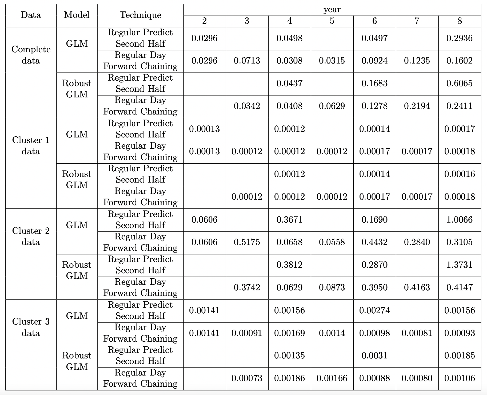

## Modeling

1. GLM
2. Robust GLM

```{r,eval=FALSE,warning=FALSE,message=FALSE}
obj1 = model.glm(training_set)
summary(obj1)

obj2 = model.glmrob(training_set)
summary(obj2)
```

## Model Adequacy Checking

1. GLM
2. Robust GLM

```{r,eval=FALSE}
draw.glm(obj1, "GLM Complete Data")
predicterror.glm(obj1, test_set)
```

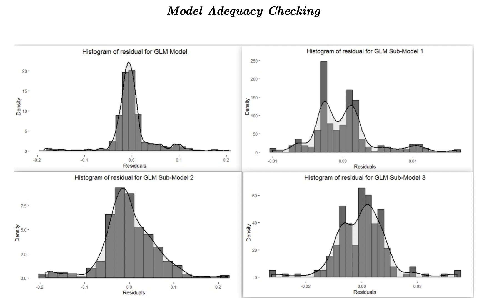

```{r,eval=FALSE}
draw.glmrob(obj2, "Robust GLM Complete Data")
predicterror.glmrob(obj2, test_set)
```

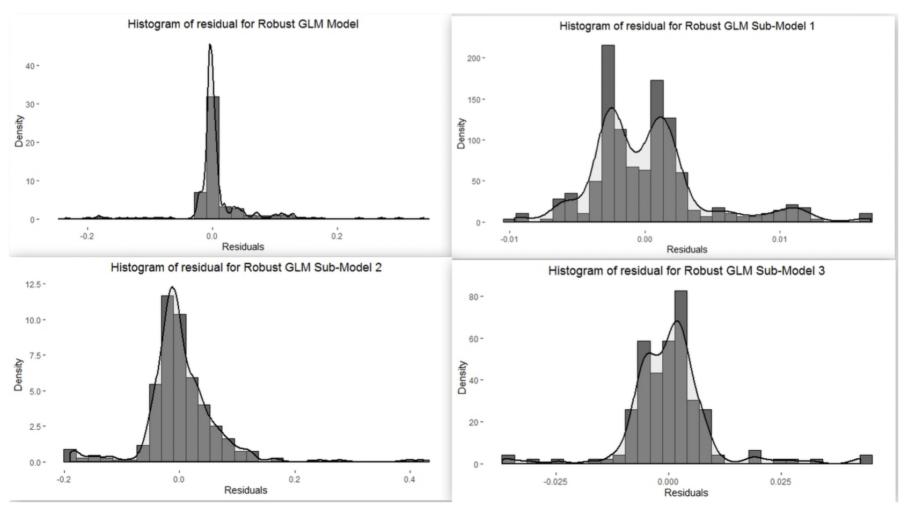

# Classification

```{r,eval=FALSE}
data <- carbon_clus.classify
data$cluster_no <- as.factor(data$cluster_no)

#Splitting the data into training and test based on earlier criteria
training_set = data[data$year >= 1 & data$year <= 8, -c(1, 2, 3)]
test_set = data[data$year == 9 | data$year == 10, -c(1, 2, 3)]
```

## Decision Trees

```{r,eval=FALSE}
######################## DECISION TREE #################################
#Decision trees dont need any preprocessing
#Works fine on actual values as well but due to large number we only do log
#transformation on the continuous variables

library(rpart)
data <- carbon_clus.submodel
data[, 4:8] <- scale(data[, 4:8]) + 3
data$cluster_no <- as.factor(data$cluster_no)
#Splitting the data into training and test based on earlier criteria
training_set = data[data$year >= 1 & data$year <= 8, -c(1, 2, 3)]
test_set = data[data$year == 9 | data$year == 10, -c(1, 2, 3)]
classobj2 <- rpart(formula = cluster_no ~ .,
                   data = training_set,
                   control = rpart.control(minsplit = 1))
pred = predict(classobj2, test_set[, -8], type = 'class')
t2 <- as.matrix(table(pred, test_set[, 8]))
rownames(t2) = c("", "Pedicted", "")
colnames(t2) = c("", "Actual", "")
cat("Accuracy Score: ", sum(diag(t2)) / nrow(test_set) * 100, "%\n")
library(rpart.plot)
rpart.plot(classobj2,
           box.palette = "RdBu",
           shadow.col = "gray",
           nn = TRUE)
```

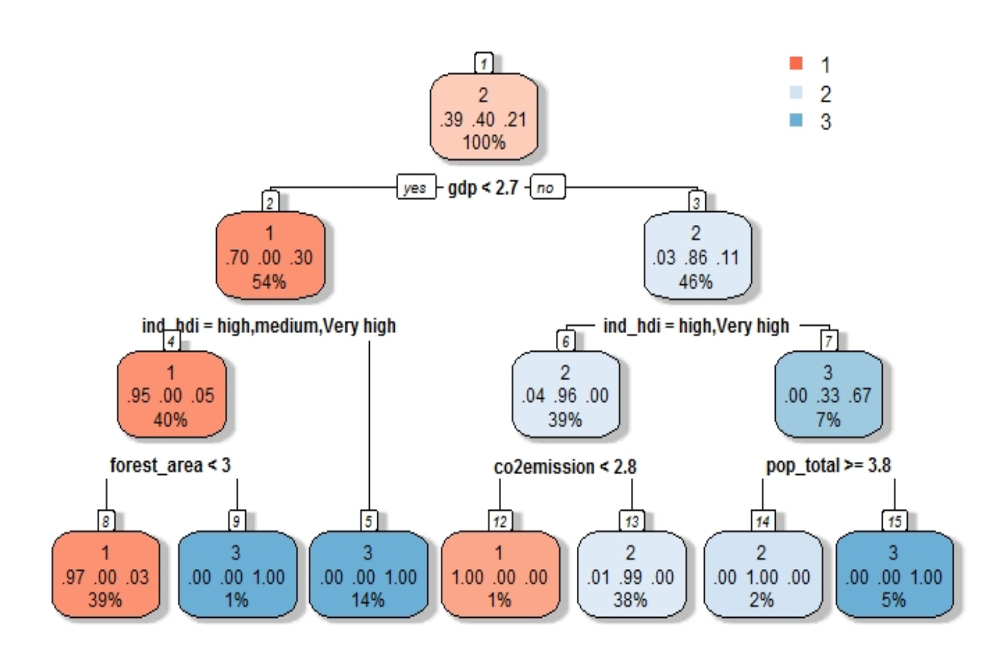

## Support Vector Machine

```{r,eval=FALSE}
#################### SVM ######################################
library(e1071)
classobj1 <-
  svm(formula = cluster_no ~ .,
      data = training_set,
      kernel = 'radial')
summary(classobj1)
pred = predict(classobj1, test_set[, -8])
t1 <- as.matrix(table(pred, test_set[, 8]))
rownames(t1) = c("", "Pedicted", "")
colnames(t1) = c("", "Actual", "")
cat("Accuracy Score: ", sum(diag(t1)) / nrow(test_set) * 100, "%\n")
```

## Categorizing carbon emission

```{r,eval=FALSE}
#Categorizing carbon emission
carbon_category <- function(x)
{
  if (x >= 600)
  {
    status = 'Extremely High'
  } else{
    if (x >= 200 & x < 600)
    {
      status = 'Very High'
    } else
    {
      if (x >= 100 & x < 200)
      {
        status = 'High'
      } else{
        if (x >= 50 & x < 100)
        {
          status = 'Moderate'
        } else{
          if (x >= 20 & x < 50)
          {
            status = 'Low'
          } else{
            status = 'Safe'
          }
        }
      }
    }
  }
  return(status)
}
```

# Prediction with test data

```{r, eval=FALSE}
###################### Prediction Result for our study
# Ready to classify using SVM
studydata1 = carbon_clus.classify[carbon_clus.classify$year == 9, ]

#Predicting the class
predclass = predict(classobj1, studydata1)
c1 = which(predclass == '1')
c2 = which(predclass == '2')
c3 = which(predclass == '3')

#Predicting carbon emission after preprocessing
studydata2 = carbon[carbon$year == 9 | carbon$year == 10, ]

#Use submodel1 for cluster1 , complete data model for cluster2 , submodel3 for cluster3
data1 = mergelevel(studydata2[c1, ] , '1')
data2 = studydata2[c2 ,]
data3 = mergelevel(studydata2[c3, ] , '3')
predval1 = predict(subobj1 , data1 , type = "response")
predval2 = predict(obj , data2 , type = "response")
predval3 = predict(subobj3 , data3 , type = "response") 
predcarbon = data.frame(rbind(data1[, 2:3], 
                              data2[, 2:3], 
                              data3[, 2:3]),
                        c(predval1 , predval2 , predval3))
names(predcarbon) = c("countries", "year", "pred emission")
```

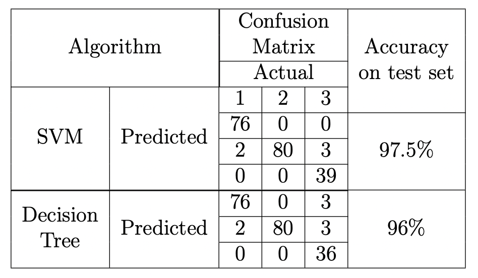
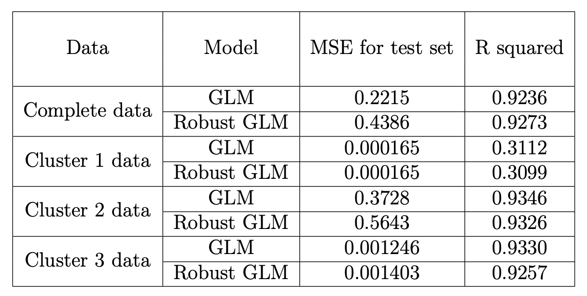

# Looking at the transition

```{r, eval=FALSE}
########### Study carbon status history 
#Checking status of predicted value
predemission_status = vector()
for (i in 1:nrow(predcarbon))
  predemission_status[i] = carbon_category(predcarbon[i , 3])
predcarbon = cbind(predcarbon, predemission_status)

library(dplyr)
carbon_map = cbind(paste0(carbon_map[, 1] , carbon_map[, 2]) , carbon_map)
names(carbon_map) <-
  c("countries year",
    "countries" ,
    "year" ,
    "co2emission" ,
    "emission status")
countries_year = paste0(predcarbon[, 1] , predcarbon[, 2])
predcarbon = cbind (countries_year , predcarbon)
predcarbon = predcarbon[, -c(2 , 3)]
histstudy = left_join(carbon_map, predcarbon , by = "countries year")[, -1]

t0 = table(histstudy [histstudy$year == 9 | histstudy$year == 10, 4],
           histstudy[histstudy$year == 9 | histstudy$year == 10, 6])
accuracy = (sum (diag(t0)) / 200) * 100
accuracy
t1 = table(histstudy[histstudy$year == 1, 4],
           histstudy [histstudy$year == 8, 4]) 
t2 = table(histstudy[histstudy$year == 1, 4], 
           histstudy [histstudy$year == 9, 6])

cat("Row vs Column:Year 1 vs Year 8\n")
t1
cat("Row vs Column:Year 1 vs Year 9\n")
t2
cat("Year 1 vs Year 8: Transition of change(Count)",
    100 - sum(diag(t1)),"\n") 
cat("Year 1 vs Year 9: Transition of change(Count)",
    100 - sum(diag(t2)),"\n")
```

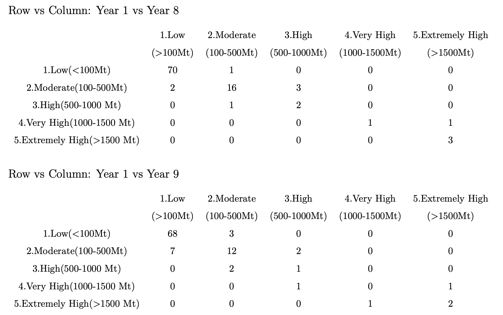
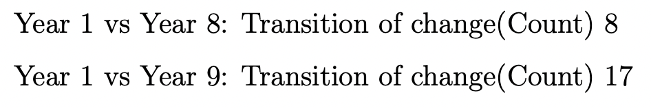

# Conclusion

In our study, we have dealt with an approach to predict carbon dioxide emission based on the classification of the countries. The study can help to understand the dynamics of climate change in a more better way than just going for a descriptive analysis. In our study, we first classify the data based on the features and based on the label predicted we choose the model to predict the carbon dioxide emission. On prediction of the carbon dioxide emission, we know the status of carbon emission through the categories created and we study the historical emissions of the countries and see the jump in the status of the countries.

In our analysis, we see that R squared measure cannot be taken as a criteria for judgment of models since as variation in the response variable reduces drastically, the R squared value deteriorates although the prediction power measured through MSE is good.By looking at the validation table, we see that sub-model 1 and sub-model 3 are the best models with not much variation between Robust GLM and GLM models. Sub-model 2 deteriorates year wise and hence it is not appropriate for prediction. Instead we can use complete model in place of sub-model 2. It has been observed that most of the time GLM model proves to be better that robust GLM model but for countries with high values or extreme values, Robust GLM is the best choice. It was noticed that due to extreme values there is deviation in the assumptions in the tail ends as visible in model adequacy checking.

In the classification problem, we see that SVM performs better than decision trees and hence SVM was used in our predictions irrespective of the year since we have made classifier considering data to be independent of time. But based on subject knowledge, decision trees are supposed to be better classifier for longitudinal data. So, this thing can be kept in mind while performing classification. After classification we perform prediction based on the models selected for the groups. Predicted values are categorized to see the transition that has occurred over the years by the 100 countries.

After the prediction and categorization we see that there is an increase in the number of countries which has shown transition between year 1 and year 9 from year 1 and year 8. This analysis can be more refined by analyzing individual countries but currently this is not part of our study. Hence, we conclude that even with limitation of data(due to smoothed data by secondary sources) we can say that this approach is very helpful in understanding the dynamics of carbon emission by countries over the years.

Future studies can involve multivariate longitudinal analysis, multivariate time series forecasting and machine learning as techniques to get better results. A minor study was made with some machine learning model(not included in the study) and it was seen that it performed better than statistical models. Also considering the complex nature of the topic and various complexities in the analysis and limitation of data, machine learning proves to be an apt technique in this field. This study was done to explain the approach in predicting carbon emission and making a useful analysis that can help in building a sustainable world in future. It is just a small contribution in our fight to reduce carbon emission and save our planet.


